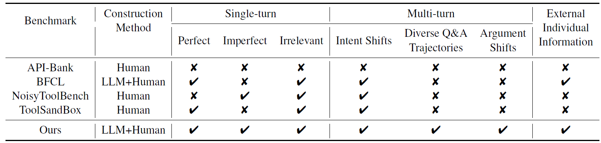
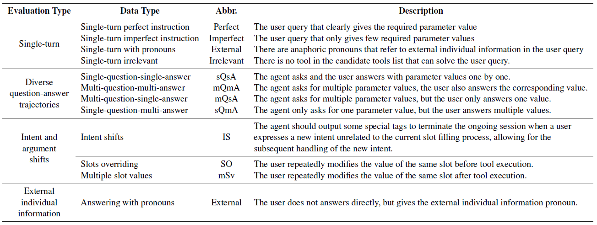

# HammerBench

The source code and dataset mentioned in the paper [**HammerBench: Fine-Grained Evaluation for Function-Calling with Multi-turn Human-LLM Interactions**](https://arxiv.org/pdf/).

## Overview
**HammerBench** is a benchmark that closely aligned with realworld slot-filling tasks in interactive dialogues. You can evaluate the performance of LLMs under various circumstances as follows:
- **imperfect instruction** :The user query that only gives few required parameter values.
- **diverse question-answer trajectories** :users may provide more or fewer responses about missing arguments than expected.
- **intent/argument shifts** :users may frequently modify their intents or arguments due to errors or other reasons during the interaction;
- **external individual information** : users may refer to external individual information indirectly, often using pronouns instead of directly specifying slot values.

Some examples are shown in the figure:
<div align="center">

</div>


The comparison between the existing and our benchmarks is as follows:
<div align="center">

</div>

## Data Construction
The construction methodology of our datasets is illustrated in the following diagram:
<div align="center">

</div>


- **toolset construction** : The construction of the toolset was inspired by selecting the most popular apps from the APP Store. We use LLMs to initially generate descriptions of tool descriptions, then manually revised. Subsequently, JSON format tools are generated based on these descriptions. The entire process includes multiple rounds of manual inspection and correction, ultimately resulting in a toolset comprising 1,063 tools.
- **basic data construction** : Based on the self-instruct method we further generate instances by outputing arguments first and then queries, and strictly controll the parameters that appear in the generated arguments. Additionally, we designed an LLM-based check module to filter out low-quality data, and manually completed the error data.
- **fine-grained data construction** : For example, 'External individual information' module can convert any query-label pairs into the dataset containing external individual information. And we also generate datasets about diverse Q&A trajectories and intent/argument shifts. 

For more details, please refer to our paper.

## Data
Please download our dataset using the following link: [HammerBench](https://huggingface.co/datasets/MadeAgents/HammerBench)
We give some examples of our datasets in 'data/', use the shareGPT format. But if you need to inference, please download all datasets!
```
{
      'id':<data-type>_<conversation-id>_<turn-id>,
      'messages':[
            {
                  'role':'user'
                  'content':<user query>
            },
            {
                  'role':'function call'
                  'content':{'name': <function name>,'arguments': <arguments>}
            }
            ...
      ],
      'multiple_tools':<candidate tools>,
      'single_tool':<ground truth function information>
}
```
While the 'id' includes three elements: 

**data-type**: 
<div align="center">

</div>

single-turn(ST-Perfect, ir-ST-Perfect, ST-Imperfect, ir-ST-Imperfect, ST-External, ir-ST-External) 

multi-turn( Diverse Q&A (Based, mQmA, mQsA, sQmA), Intent shifts (IS), Argument shifts (SO-case1, SO-case2, mSv), External individual information (External))

**conversation-id** represents the indice in 'Based' data-type for data before transformation (e.g. w/o SO...).

**turn-id** represents turn-id-th function calling snapshot in the conversation.

All datasets are transformed from the 'HammerBench_Based.json' in the sQsA format.

As for Chinese dataset, please see 'zh/'.


## Evaluation
### Evaluate the log file inferenced by LLMs
evaluate.py requires inference_res.json file. the item of inference_res.json is inferenced by Qwen2.5-7B-Instruct as follows:
```
{
    "id": "Based_0_3",
    "input": "user:Check if my car has any illegal records\nassistant:What city is the violation located in?\nuser:The violating city is Guangzhou.\nassistant:Please provide the license plate number\nuser:My license plate number is Yue B67890.",
    "predict": "```json\n{\"name\": \"Navigation.TrafficViolations.queryViolation\", \"parameters\": {\"plate_number\": \"Yue B67890\", \"city\": \"Guangzhou\", \"time\": \"\"}}\n```",
    "label": {
        "name": "Navigation.TrafficViolations.queryViolation",
        "arguments": {
          "city": "Guangzhou",
          "plate_number": "Yue B67890"
        }
    }
}
```

Use the following command for evaluation:
```
python evaluate.py <log_dir> <language>
```

For example, to evaluate the Qwen2.5-7B-Instruct model:
```
python evaluate.py logs/Qwen2.5-7B-Instruct en
```

## Evaluation for more LLMs:
If you need to adapt post-processing method for different output formats, please modify :
```
evaluation/process_output.py
```


## Citation

If you use HammerBench, please cite our paper:
```
@misc{hammerbench,
      title={HammerBench: Fine-Grained Evaluation for Function-Calling with Multi-turn Human-LLM Interactions}, 
      author={},
      year={2024},
      eprint={},
      archivePrefix={arXiv},
      primaryClass={cs.LG},
      url={https://arxiv.org/abs/}, 
}
```